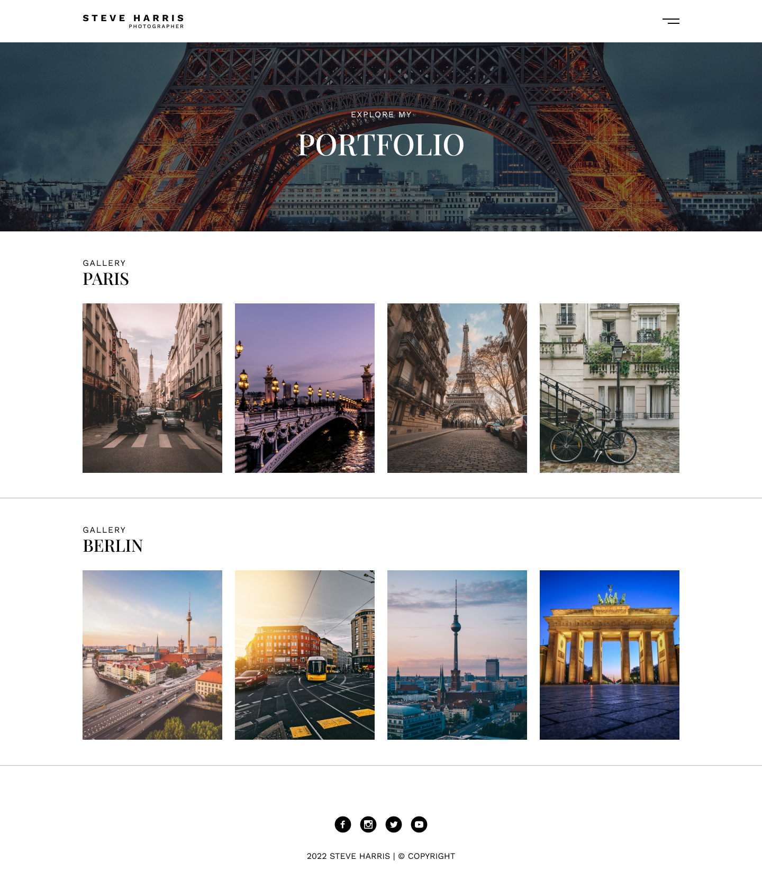

# Prueba técnica HTML Y CSS

Como prueba técnica de HTML y CSS te proponemos crear la siguiente página web: 

### Critererios de aceptación
- El banner principal debe ser un div con la imagen de parís como background, debes aplicar un gradiente lineal para oscurecer la imágen `linear-gradient(0deg, #00000080 0%, #00000080 100%)`

- La pagina debe ser responsive, es decir debe verse bien en todos los dispositivos (computadores, tabletas y celulares), el diseño es libre pero debes mostrar todas las imágenes y **NO DEBE HABER SCROLL LATERAL**

- Los iconos e imágenes necesarias los vas a encontrar en la carpeta `./resources/`

 

    
